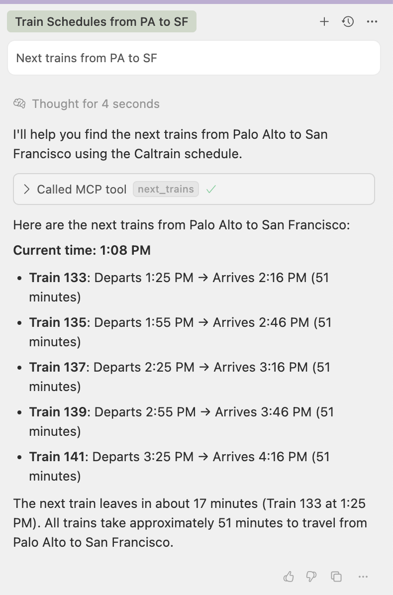

# 🚂 Caltrain MCP Server (Because You Love Waiting for Trains)

[](https://pypi.org/project/caltrain-mcp/)
[](https://github.com/davidyen1124/caltrain-mcp/actions/workflows/ci.yml)



A Model Context Protocol (MCP) server that promises to tell you _exactly_ when the next Caltrain will arrive... and then be 10 minutes late anyway. Uses real GTFS data, so at least the disappointment is official!

## Features (Or: "Why We Built This Thing")

- 🚆 **"Real-time" train schedules** - Get the next departures between any two stations (actual arrival times may vary by +/- infinity)
- 📍 **Station lookup** - Because apparently 31 stations is too many to memorize 🤷‍♀️
- 🕐 **Time-specific queries** - Plan your commute with surgical precision, then watch it all fall apart
- ✨ **Smart search** - Type 'sf' instead of the full name because we're all lazy here
- 📊 **GTFS-based** - We use the same data Caltrain does, so when things go wrong, we can blame them together
- 🖼️ **Interactive timetable UI** - An [MCP App](https://modelcontextprotocol.io/docs/extensions/apps) that shows the trains that matter to you right in ChatGPT (or any MCP Apps host), expands to the whole day, and goes fullscreen while you keep chatting
- ☁️ **Hosted for you** - A remote Streamable HTTP server on Vercel, so you don't even have to install anything to be disappointed
- 🌙 **Late-night aware** - Knows the 12:05 AM train belongs to _yesterday's_ schedule, and that Thanksgiving runs a weekend timetable

## Setup (The Fun Part 🙄)

1. **Install dependencies** (aka "More stuff to break"):

   ```bash
   # Install uv if you haven't already (because pip is apparently too mainstream now)
   curl -LsSf https://astral.sh/uv/install.sh | sh

   # Install dependencies using uv (fingers crossed it actually works)
   uv sync
   ```

2. **Get that sweet, sweet GTFS data**:
   The server expects Caltrain GTFS data in the `src/caltrain_mcp/data/caltrain-ca-us/` directory. Because apparently we can't just ask the trains nicely where they are.

   ```bash
   uv run python scripts/fetch_gtfs.py
   ```

   This magical script downloads files that contain:

   - `stops.txt` - All the places trains pretend to stop
   - `trips.txt` - Theoretical journeys through space and time
   - `stop_times.txt` - When trains are _supposed_ to arrive (spoiler: they don't)
   - `calendar.txt` - Weekday vs weekend schedules (because trains also need work-life balance)

## Usage (Good Luck!)

### In ChatGPT (The Shiny Way ✨)

There's a hosted server at **`https://caltrain-mcp-rho.vercel.app/mcp`**. No auth, no install, no excuses.

1. In ChatGPT (web, Plus/Pro/Business/Enterprise/Edu) go to **Plugins → Add → Create MCP App**
2. Name it `Caltrain`, paste the URL above, set **Authentication** to **No authentication**, tick the scary checkbox, and hit **Create**, then **Connect**
3. Ask away: _"When's the next train from Palo Alto to SF?"_, _"I need to be in SF by 9am Monday"_, _"Last train to San Jose tonight?"_

ChatGPT shows a timetable card with the few trains that answer your question. From there you can:

- Tap a train to see every stop it makes (and at what time it'll pretend to arrive)
- Hit **Show more** to reveal later trains
- Hit **Full day timetable** to go fullscreen: switch stations, swap direction, flip through days, and filter to Express / Limited / Local, all while chatting ("which of these gets me in before 9?"). The model knows what you're looking at.

After redeploying the server, open the app under **Settings → Plugins → Caltrain → Refresh tools** so ChatGPT picks up the changes.

### As an MCP Server (The Real Deal)

This server is designed to be used with MCP clients like Claude Desktop, not run directly by humans (because that would be too easy). Here's how to actually use it:

#### With Claude Desktop

Add this to your Claude Desktop MCP configuration file:

```json
{
  "mcpServers": {
    "caltrain": {
      "command": "uvx",
      "args": ["caltrain-mcp"]
    }
  }
}
```

This will automatically install and run the latest version from PyPI.

Then restart Claude Desktop and you'll have access to Caltrain schedules directly in your conversations!

#### With Other MCP Clients

Any MCP-compatible client can use this server by starting it with:

```bash
uvx caltrain-mcp
```

The server communicates via stdin/stdout using the MCP protocol. It doesn't do anything exciting when run directly - it just sits there waiting for proper MCP messages.

#### Over HTTP (For Remote Clients)

```bash
uvx caltrain-mcp --http --port 8000
# MCP endpoint: http://127.0.0.1:8000/mcp
```

It speaks stateless Streamable HTTP with JSON responses, which is exactly what serverless platforms like. When bound to localhost, DNS-rebinding protection is on.

#### Deploying to Vercel

The repo root has an `app.py` that exposes the ASGI app, so Vercel's Python runtime picks it up with zero config (it installs from `pyproject.toml` + `uv.lock`):

```bash
npx vercel@latest deploy --prod
```

The MCP endpoint is `/mcp`; `/` is a tiny landing page and `/health` reports whether the GTFS data loaded.

### Testing the Server (For Development)

You can test if this thing actually works by importing it directly:

```python
from caltrain_mcp.server import next_trains, list_stations

# Test next trains functionality (prepare for disappointment)
result = await next_trains('San Jose Diridon', 'San Francisco')
print(result.content[0].text)  # Spoiler: there are no trains
print(result.structured_content["trains"])  # Same disappointment, now as JSON

# Test stations list (all 31 of them, because apparently that's manageable)
stations = await list_stations()
print(stations)
```

## Available Tools (Your New Best Friends)

### `next_trains(origin, destination, when_iso=None, arrive_by_iso=None, limit=3)`

Ask politely when the next train will show up. The server will consult its crystal ball (GTFS data) and give you times that are _technically_ accurate. In hosts that support MCP Apps it also renders the interactive timetable.

**Parameters:**

- `origin` (str): Where you are now (probably regretting your life choices)
- `destination` (str): Where you want to be (probably anywhere but here)
- `when_iso` (str, optional): Leave at or after this Pacific time (as if time has any meaning in public transit)
- `arrive_by_iso` (str, optional): Instead, find the latest trains that get you there by this Pacific time (for people with meetings)
- `limit` (int, optional): How many trains to suggest, 1-10 (default 3)

Times are always Pacific. Timezone-aware inputs like `2026-09-28T16:00:00Z` are converted, so 4pm UTC really means 9am in Palo Alto. If nothing is left tonight, you get tomorrow's first trains instead of a shrug. If there's no direct train (hello, Gilroy → SF), it tells you where to change.

**Returns:** a short text answer, `structuredContent` with the suggested trains for the model, and the full day's timetable (with every stop) in `_meta` for the UI.

**Examples:**

```python
# Next trains from current time (aka "right now would be nice")
next_trains('San Jose Diridon', 'San Francisco')

# Trains at a specific time (for the optimists who think schedules matter)
next_trains('Palo Alto', 'sf', '2025-05-23T06:00:00')

# Using abbreviations (because typing is hard)
next_trains('diridon', 'sf')
```

### `list_stations()`

Get a list of all 31 Caltrain stations, because memorizing them is apparently too much to ask.

**Returns:**
A formatted list that will make you realize just how many places this train supposedly goes.

### `get_timetable(origin, destination, date=None)` (UI only)

The full day's timetable between two stations. It's marked app-only (`_meta.ui.visibility: ["app"]`), so the model doesn't see it; the timetable UI calls it when you switch stations or days.

## Station Name Recognition (We're Not Mind Readers, But We Try)

The server supports various ways to be lazy about typing station names:

- **Full names**: "San Jose Diridon Station" (for the perfectionists)
- **Short names**: "San Francisco" (for the slightly less perfectionist)
- **Abbreviations**: "sf" → "San Francisco" (for the truly lazy)
- **Partial matching**: "diridon" matches "San Jose Diridon Station" (for when you can't be bothered)

## Available Stations (All 31 Glorious Stops)

The server covers every single Caltrain station because we're completionists:

**San Francisco to San Jose** (The Main Event):

- San Francisco, 22nd Street, Bayshore, South San Francisco, San Bruno, Millbrae, Broadway, Burlingame, San Mateo, Hayward Park, Hillsdale, Belmont, San Carlos, Redwood City, Menlo Park, Palo Alto, Stanford, California Avenue, San Antonio, Mountain View, Sunnyvale, Lawrence, Santa Clara, College Park, San Jose Diridon

**San Jose to Gilroy** (The "Why Does This Exist?" Extension):

- Tamien, Capitol, Blossom Hill, Morgan Hill, San Martin, Gilroy

## Sample Output (Prepare to Be Amazed)

```
Next Caltrain departures from San Francisco to Mountain View after 5:00 PM (Monday, September 28, 2026, Weekday schedule):
• Train 522 (Express): 5:20 PM → 6:06 PM, 46 min, 7 stops in between
• Train 150 (Local): 5:25 PM → 6:24 PM, 59 min, 16 stops in between
• Train 424 (Limited): 5:48 PM → 6:39 PM, 51 min, 10 stops in between
52 trains run this route that day (first 4:55 AM, last 12:05 AM).
```

_Actual arrival times may vary. Side effects may include existential dread and a deep appreciation for remote work._

## Technical Details (For the Nerds)

- **GTFS Processing**: We automatically handle the relationship between stations and their platforms (because apparently trains are complicated)
- **Service Calendar**: Respects weekday/weekend schedules and holiday exceptions (trains also need their beauty rest)
- **Pacific Time, Always**: Server clocks live in UTC; Caltrain does not. We convert.
- **After Midnight**: GTFS times like `24:35:00` belong to the previous service day, and we treat them that way
- **Data Types**: Handles the chaos that is mixed integer/string formats in GTFS files
- **Time Parsing**: Supports 24+ hour format for those mythical late-night services
- **Error Handling**: Gracefully fails when you type "Narnia" as a station name

## Project Structure (The Organized Chaos)

```
caltrain-mcp/
├── .github/workflows/         # GitHub Actions (the CI/CD overlords)
│   ├── ci.yml                 # Main CI pipeline (linting, testing, the works)
│   └── update-gtfs.yml        # Automated GTFS data updates
├── app.py                     # Vercel entrypoint (re-exports the ASGI app)
├── src/caltrain_mcp/          # Main package (because modern Python demands structure)
│   ├── data/caltrain-ca-us/   # GTFS data storage (where CSV files go to retire)
│   ├── ui/timetable.html      # Built timetable UI (generated from web/, committed)
│   ├── __init__.py            # Package initialization (the ceremony of Python)
│   ├── __main__.py            # Entry point for python -m caltrain_mcp
│   ├── server.py              # MCP tools + the MCP Apps UI resource
│   ├── http_app.py            # Streamable HTTP app for remote hosting
│   ├── schedule.py            # Timetable queries (time zones, midnight, arrive-by)
│   └── gtfs.py                # GTFS data processing (aka "CSV wrestling")
├── web/                       # Timetable UI sources (TypeScript + Vite + ext-apps SDK)
├── scripts/                   # Utility scripts (the supporting cast)
│   ├── __init__.py            # Makes scripts a proper Python package
│   ├── fetch_gtfs.py          # Downloads the latest disappointment data
│   └── lint.py                # Run all CI checks locally (before embarrassment)
├── tests/                     # Test suite (because trust but verify)
│   ├── conftest.py            # Shared test fixtures (the common ground)
│   ├── test_gtfs.py           # GTFS functionality tests (8 tests of data wrangling)
│   ├── test_schedule.py       # Timetable engine tests (midnight, holidays, transfers)
│   ├── test_server.py         # MCP tool tests
│   ├── test_http.py           # Streamable HTTP end-to-end tests
│   └── test_fetch_gtfs.py     # Data fetching tests (7 tests of download chaos)
├── .pre-commit-config.yaml    # Pre-commit hooks configuration
├── pyproject.toml             # Modern Python config (because setup.py is so 2020)
└── README.md                  # This literary masterpiece
```

## Development & Testing (For When Things Inevitably Break)

### The Timetable UI

The UI lives in `web/` and is built into a single self-contained HTML file with the
[`@modelcontextprotocol/ext-apps`](https://github.com/modelcontextprotocol/ext-apps) SDK:

```bash
cd web
npm ci
npm run build   # writes src/caltrain_mcp/ui/timetable.html
```

The built file is committed, so neither PyPI installs nor Vercel need Node; CI fails if it's out of date.
Hosts (ChatGPT especially) cache UI resources by URI, so bump `TIMETABLE_URI` in `server.py`
(`ui://caltrain/timetable-vN.html`) when you ship UI changes.

To try it without ChatGPT, run `uv run caltrain-mcp --http` and point the ext-apps
[basic-host example](https://github.com/modelcontextprotocol/ext-apps/tree/main/examples/basic-host) at `http://localhost:8000/mcp`.

### Code Quality & CI/CD

This project uses modern Python tooling to keep the code clean and maintainable:

- **Ruff**: Lightning-fast linting and formatting (because life's too short for slow tools)
- **MyPy**: Type checking (because guessing types is for amateurs)
- **Pytest**: Testing framework with coverage reporting

### Release Process (Automated Awesomeness)

This project uses automated versioning and publishing:

- **Semantic Versioning**: Version numbers are automatically determined from commit messages using [Conventional Commits](https://www.conventionalcommits.org/)
- **Automatic Tagging**: When you push to `main`, semantic-release creates version tags automatically
- **PyPI Publishing**: Tagged releases are automatically built and published to PyPI via GitHub Actions
- **Trusted Publishing**: Uses OIDC authentication with PyPI (no API tokens needed!)

#### Making a Release

Just commit using conventional commit format and push to main:

```bash
# For bug fixes (patch version bump: 1.0.0 → 1.0.1)
git commit -m "fix: correct station name lookup bug"

# For new features (minor version bump: 1.0.0 → 1.1.0)
git commit -m "feat: add support for weekend schedules"

# For breaking changes (major version bump: 1.0.0 → 2.0.0)
git commit -m "feat!: redesign API structure"
# or
git commit -m "feat: major API changes

BREAKING CHANGE: This changes the function signatures"
```

The semantic-release workflow will:

1. Analyze your commit messages
2. Determine the appropriate version bump
3. Create a git tag (e.g., `v1.2.3`)
4. Generate a changelog
5. Trigger the release workflow to publish to PyPI

#### Local Testing

Test the build process locally before pushing:

```bash
# Build packages locally
uv run python -m build --sdist --wheel

# Validate packages
uv run twine check dist/*

# Test upload to Test PyPI (optional)
uv run twine upload --repository testpypi dist/*
```

#### GitHub Actions CI

Every PR and push to main triggers automatic checks:

- ✅ **Linting**: Ruff checks for code quality issues
- ✅ **Formatting**: Ensures consistent code style
- ✅ **Type Checking**: MyPy validates type annotations
- ✅ **Tests**: Full test suite with coverage reporting
- ✅ **Coverage**: Test coverage reporting in CI logs

The CI will politely reject your PR if any checks fail, because standards matter.

## MCP Integration (For the AI Overlords)

This server implements the Model Context Protocol (MCP), which means it's designed to work seamlessly with AI assistants and other MCP clients. Once configured:

- **Claude Desktop**: Ask Claude about train schedules directly in conversation
- **Other MCP Clients**: Any MCP-compatible tool can access Caltrain data
- **Real-time Integration**: Your AI can check schedules, suggest routes, and help plan trips
- **Natural Language**: No need to remember station names or command syntax

The server exposes these tools:

- `next_trains` - Get upcoming departures between stations (with the timetable UI)
- `list_stations` - Browse all available Caltrain stations
- `get_timetable` - Full-day timetable, used by the UI only

So your AI assistant can now disappoint you about train schedules just like a real human would! The future is truly here.

## License (The Legal Stuff)

This project uses official Caltrain GTFS data. If something goes wrong, blame them, not us. We're just the messenger.

---

_Built with ❤️ and a concerning amount of caffeine in the Bay Area, where public transit is both a necessity and a source of eternal suffering._
