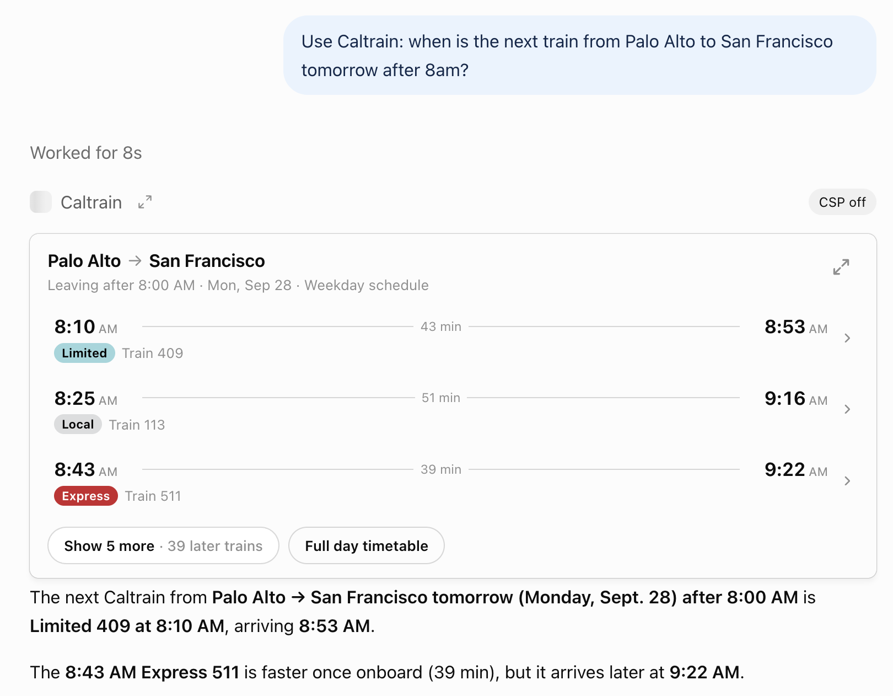
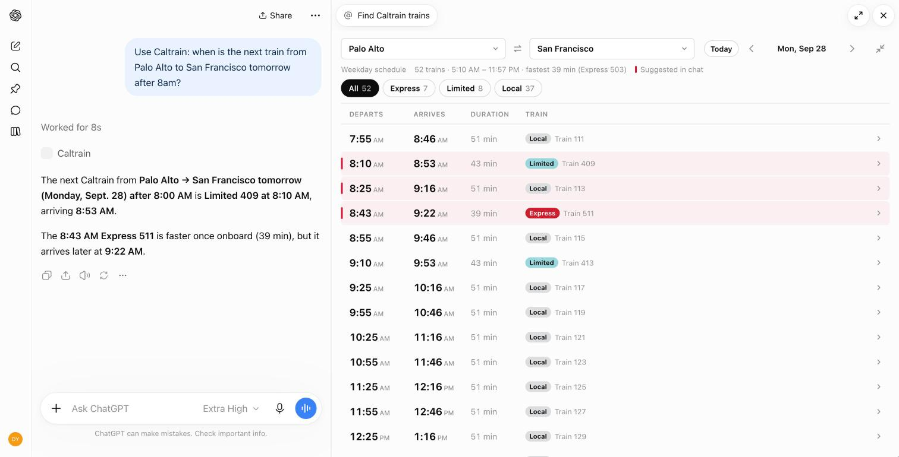

# 🚂 Caltrain MCP (Because You Love Waiting for Trains)

[](https://github.com/davidyen1124/caltrain-mcp/actions/workflows/ci.yml)

**Live at [caltrain-mcp-rho.vercel.app](https://caltrain-mcp-rho.vercel.app)**, with a live demo of the timetable view.

A remote [Model Context Protocol](https://modelcontextprotocol.io) server that tells you _exactly_ when the next Caltrain leaves... and then it's 10 minutes late anyway. It uses Caltrain's official GTFS schedule, so at least the disappointment is official.

In ChatGPT (and any other host that supports [MCP Apps](https://modelcontextprotocol.io/docs/extensions/apps)), answers come with an interactive timetable instead of a wall of text. Everywhere else you get the same answer as plain text.

<p align="center">
  
</p>

Open **Full day timetable** and the whole day sits next to the chat, with station and date pickers and Express / Limited / Local filters:



## Features (Or: "Why We Built This Thing")

- 🚆 **Next trains** between any two stations, from now or from any time you like
- 🎯 **Arrive-by planning**: "I need to be in SF by 9" finds the latest trains that still make it, and skips the ones that already left
- 🌙 **Late-night aware**: knows the 12:05 AM train belongs to _yesterday's_ schedule, that Thanksgiving runs a weekend timetable, and that South County has no weekend service
- 🔁 **Transfers explained**: when there's no direct train, it tells you where to change
- ✨ **Lazy typing welcome**: `sf`, `sj`, `mv`, `rc`, `22nd`, `cal ave`...
- 🖼️ **The timetable view**: tap a train for its stops, show later trains, or open the full-day timetable with station/date pickers and Express / Limited / Local filters. The model knows what you're looking at, so "which of these gets me in before 9?" just works
- 🌗 Looks right in light and dark mode, on desktop and phones

## Add It to Your Assistant

The server lives at:

```text
https://caltrain-mcp-rho.vercel.app/mcp
```

Streamable HTTP, no authentication, no install, no excuses.

| Client | How |
| --- | --- |
| **ChatGPT** | **Plugins → Add → Create MCP App** (needs a plan with developer mode). Name it `Caltrain`, paste the URL, choose **No authentication**, **Create**, then **Connect**. |
| **Claude** | **Settings → Connectors → Add custom connector**, paste the URL. |
| **Claude Code** | `claude mcp add --transport http caltrain https://caltrain-mcp-rho.vercel.app/mcp` |
| **Codex** | `codex mcp add caltrain --url https://caltrain-mcp-rho.vercel.app/mcp` |
| **VS Code** | `.vscode/mcp.json`: `{ "servers": { "caltrain": { "type": "http", "url": "https://caltrain-mcp-rho.vercel.app/mcp" } } }` |
| **Cursor** | `~/.cursor/mcp.json`: `{ "mcpServers": { "caltrain": { "url": "https://caltrain-mcp-rho.vercel.app/mcp" } } }` |

Then ask away: _"When's the next train from Palo Alto to SF?"_, _"I need to be in SF by 9am Monday"_, _"Last train to San Jose tonight?"_

> **Coming from the PyPI package?** `uvx caltrain-mcp` (0.8.x, Python, stdio) still installs but no longer gets updates. Point your client at the URL above instead.

## Tools

| Tool | What it does |
| --- | --- |
| `next_trains` | Trains between two stations after a time (or arriving by one). Renders the timetable view. |
| `list_stations` | Every station, for when the model can't spell "Hillsdale". |
| `get_timetable` | A full day between two stations. App-only: the timetable view calls it when you switch stations or days. |

All read-only. Times are Pacific.

## How It Works

- **[Next.js](https://nextjs.org) on [Vercel](https://vercel.com)**: [`app/mcp/route.ts`](app/mcp/route.ts) serves MCP with the official [TypeScript SDK](https://github.com/modelcontextprotocol/typescript-sdk)'s `createMcpHandler`: stateless, one fresh server per request, so any serverless instance can answer anything. The landing page is [`app/page.tsx`](app/page.tsx).
- **Schedule engine**: [`lib/schedule.ts`](lib/schedule.ts) turns GTFS into per-day timetables with Pacific time, DST, after-midnight trips and calendar exceptions. The raw feed lives in [`data/gtfs/`](data/gtfs/) and is compiled to JSON at build time, so a cold start never parses CSV.
- **Timetable view**: [`widget/`](widget/) is a React + [Tailwind](https://tailwindcss.com) + [shadcn/ui](https://ui.shadcn.com) app built with Vite into one self-contained HTML file. That file is served as the `ui://` resource via [`@modelcontextprotocol/ext-apps`](https://github.com/modelcontextprotocol/ext-apps). It picks up the host's theme, fonts and colours.
- **Fresh data**: a weekly GitHub Action downloads the latest GTFS feed, runs the tests against it and opens a PR. Merging deploys it.

## Development (For When Things Inevitably Break)

```bash
npm install
npm run dev        # http://localhost:3000, MCP at http://localhost:3000/mcp
npm test           # vitest
npm run typecheck
npm run build
```

`npm run dev`, `build`, `test` and `typecheck` first run `npm run generate`. That compiles the GTFS feed and builds the widget into `lib/generated/`, which is gitignored.

- **Timetable view**: edit `widget/src`, then `npm run widget:build` (or `widget:dev` to rebuild on save). The landing page's live demo is a tiny MCP Apps host, so the homepage is the fastest way to try UI changes.
- **UI caching**: hosts (ChatGPT especially) cache UI resources by URI. Bump `TIMETABLE_URI` in [`lib/mcp/constants.ts`](lib/mcp/constants.ts) when you ship UI changes, then use **Refresh tools** in the ChatGPT app settings.
- **New feed by hand**: `npm run gtfs:fetch`.

```text
app/            Next.js: landing page and the /mcp route
components/     Site components and shadcn/ui primitives (shared with the widget)
lib/            Schedule engine, GTFS loading, MCP server definition
widget/         The timetable view (MCP App)
data/gtfs/      Caltrain GTFS feed
tests/          Vitest suites
```

## Deployment

Vercel's GitHub integration does the work: pull requests get preview deployments, and `main` deploys to production. CI ([`ci.yml`](.github/workflows/ci.yml)) typechecks, tests and builds every PR.

## License (The Legal Stuff)

See [LICENSE.md](LICENSE.md). This project uses official Caltrain GTFS data but is not affiliated with Caltrain. If something goes wrong, blame them, not us. We're just the messenger.

---

_Built with ❤️ and a concerning amount of caffeine in the Bay Area, where public transit is both a necessity and a source of eternal suffering._
